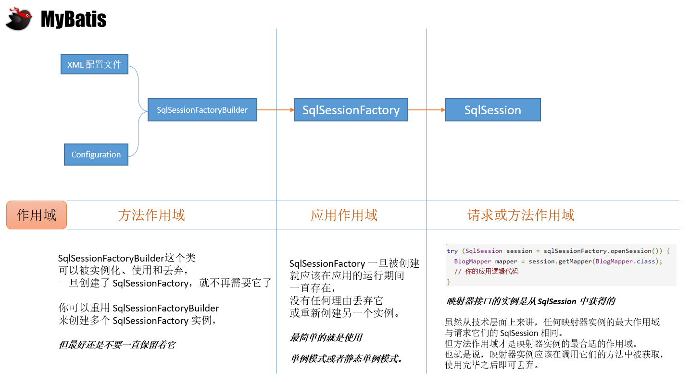

# MyBatis系列文章

## MyBatis简单认识

MyBatis属于Java中很出色的一个持久层框架，能够灵活的自定义SQL，对数据库中的数据进行添加、删除、修改和查询操作。

MyBatis免除了几乎所有的JDBC代码，以及设置参数和获取查询结果的工作。可以通过XML文件或注解的方式来配置和映射原始类型、接口和POJO为数据库中的记录。

## 核心接口SqlSessionFactory
MyBatis主要和数据库进行交互，少不了创建数据库连接，其中SqlSessionFactory是主要的核心。



上面这张图是对[官网简介](https://mybatis.org/mybatis-3/zh/getting-started.html)的一个总结，通过这个简单的描述可以回答下面两个问题：

1. 如何创建SqlSessionFactory？

	SqlSessionFactory（简称SSF） 通过 SqlSessionFactoryBuilder (简称SSFB)创建。

	SSFB创建SSF的过程中，需要一些数据库JDBC的信息，这些信息可以通过XML文件或Java的Configuration对象来获取。

2. 如何使用SqlSessionFactory？

	SSF 创建好之后，基本上就保证它==应用级别的作用域==，不对其进行重复的创建和销毁操作。

	最简单的是通过单例模式或静态单例模式来达到应用级别的作用域。


## 实战

### 1. Maven创建Java项目
*本地需要安装Maven，然后才能执行下面的代码。*
```sh
 mvn archetype:generate -DgroupId=com.botao -DartifactId=pure-mybatis -DarchetypeArtifactId=maven-archetype-quickstart
```

### 2. 添加依赖
pom.xml 文件中添加下面的依赖
```xml
  <dependencies>
    <dependency>
      <groupId>org.mybatis</groupId>
      <artifactId>mybatis</artifactId>
      <version>3.5.2</version>
    </dependency>
    <dependency>
      <groupId>mysql</groupId>
      <artifactId>mysql-connector-java</artifactId>
      <version>5.1.44</version>
    </dependency>
  </dependencies>
```
### 3. 配置JDBC属性
resources目录下创建 `application.properties`文件，并输入下面的配置信息。
```properties
jdbc.driver=com.mysql.jdbc.Driver
jdbc.url=jdbc:mysql://localhost:3306/university?characterEncoding=UTF-8
jdbc.username=root
jdbc.password=123456
```

### 4. 配置MyBatis需要的配置文件
resources目录下创建`mybatis-config.xml`文件，并输入下面的配置信息。
```xml
<?xml version="1.0" encoding="UTF-8" ?>
<!DOCTYPE configuration
        PUBLIC "-//mybatis.org//DTD Config 3.0//EN"
        "http://mybatis.org/dtd/mybatis-3-config.dtd">
<configuration>

  <properties resource="application.properties"/>

  <environments default="development">
    <environment id="development">
      <transactionManager type="JDBC"/>
      <dataSource type="POOLED">
        <property name="driver" value="${jdbc.driver}"/>
        <property name="url" value="${jdbc.url}"/>
        <property name="username" value="${jdbc.username}"/>
        <property name="password" value="${jdbc.password}"/>
      </dataSource>
    </environment>
  </environments>
  <mappers>
    <mapper resource="mapper/PersonMapper.xml"/>
  </mappers>
</configuration>
```
**注意：**
	1. 开头部分声明是xml文件
	2. `<properties resource="application.properties"/>` 声明本文中的属性从 `application.properties`中获取
	3. `<mapper resource="mapper/PersonMapper.xml"/>` 声明与数据库表的映射接口文件位置

### 5. 准备数据

```sql
CREATE DATABASE `university` ;

CREATE TABLE `person` (
  `id` bigint(20) NOT NULL AUTO_INCREMENT,
  `name` varchar(100) DEFAULT NULL,
  `age` int(11) DEFAULT NULL,
  PRIMARY KEY (`id`)
) ENGINE=InnoDB AUTO_INCREMENT=12 DEFAULT CHARSET=utf8mb4 ;

INSERT INTO `university`.`person`(`id`, `name`, `age`) VALUES (1, 'poter1', 10);
INSERT INTO `university`.`person`(`id`, `name`, `age`) VALUES (2, 'poter2', 20);
INSERT INTO `university`.`person`(`id`, `name`, `age`) VALUES (3, 'poter3', 30);
INSERT INTO `university`.`person`(`id`, `name`, `age`) VALUES (4, 'poter4', 40);
INSERT INTO `university`.`person`(`id`, `name`, `age`) VALUES (5, 'poter5', 50);
INSERT INTO `university`.`person`(`id`, `name`, `age`) VALUES (6, 'poter6', 60);
INSERT INTO `university`.`person`(`id`, `name`, `age`) VALUES (7, 'poter7', 70);
INSERT INTO `university`.`person`(`id`, `name`, `age`) VALUES (8, 'poter8', 80);
INSERT INTO `university`.`person`(`id`, `name`, `age`) VALUES (9, 'poter9', 90);
INSERT INTO `university`.`person`(`id`, `name`, `age`) VALUES (10, 'poter10', 100);
INSERT INTO `university`.`person`(`id`, `name`, `age`) VALUES (11, 'poter11', 110);

```

### 6. 创建数据库表对应的POJO
```java
package com.botao.pojo;

public class Person {
    private int id;
    private String name;
    private int age;

    public Person() {
    }

    public int getId() {
        return id;
    }

    public void setId(int id) {
        this.id = id;
    }

    public String getName() {
        return name;
    }

    public void setName(String name) {
        this.name = name;
    }

    public int getAge() {
        return age;
    }

    public void setAge(int age) {
        this.age = age;
    }

    @Override
    public String toString() {
        return "PersonMapper{" +
                "id=" + id +
                ", name='" + name + '\'' +
                ", age=" + age +
                '}';
    }
}
```

### 6. 创建Mapper接口

```java
package com.botao.mapper;

import com.botao.pojo.Person;

public interface PersonMapper {

    Person selectPersonById(Integer id);
}
```

### 7. 创建XML的Mapper文件
在resources/mapper目录下创建`PersonMapper.xml`文件，并配置如下信息：
```xml
<?xml version="1.0" encoding="UTF-8" ?>
<!DOCTYPE mapper
        PUBLIC "-//mybatis.org//DTD Mapper 3.0//EN"
        "http://mybatis.org/dtd/mybatis-3-mapper.dtd">
<mapper namespace="com.botao.mapper.PersonMapper">
  <select id="selectPersonById" resultType="com.botao.pojo.Person">
    select * from Person where id = #{id}
  </select>
</mapper>
```
好了，到目前位置，我们的工程就完成了，可以创建一个main方法，或用Junit来测试下。

这里写一个Main方法做下测试：
```java
package com.botao;

import com.botao.mapper.PersonMapper;
import com.botao.pojo.Person;
import org.apache.ibatis.io.Resources;
import org.apache.ibatis.session.SqlSession;
import org.apache.ibatis.session.SqlSessionFactory;
import org.apache.ibatis.session.SqlSessionFactoryBuilder;

import java.io.IOException;
import java.io.InputStream;

public class App {
    public static void main(String[] args) throws IOException {
        System.out.println("use mybatis connect to database ... ");

        // 根据 mybatis-config.xml 配置的信息得到 sqlSessionFactory
        String resource = "mybatis-config.xml";
        InputStream inputStream = Resources.getResourceAsStream(resource);
        SqlSessionFactory sqlSessionFactory = new SqlSessionFactoryBuilder().build(inputStream);
        // 然后根据 sqlSessionFactory 得到 session
        SqlSession session = sqlSessionFactory.openSession();

        PersonMapper mapper = session.getMapper(PersonMapper.class);

        Person person = mapper.selectPersonById(1);
        System.out.println(person);

    }
}
```

测试结果：
```log
C:\app\java\jdk1.8.0_131\bin\java.exe  ...
use mybatis connect to database ... 
PersonMapper{id=1, name='poter1', age=10}

Process finished with exit code 0
```

OK！这就是所有内容了，如果对上面的说明有任何疑问， 欢迎留言与我交流。

## 题外话

1. 如何将maven将项目打包成一个可以运行的独立jar

```xml
  <build>
    <plugins>
      <plugin>
        <groupId>org.apache.maven.plugins</groupId>
        <artifactId>maven-shade-plugin</artifactId>
        <version>3.2.0</version>
        <executions>
          <!-- Attach the shade goal into the package phase -->
          <execution>
            <phase>package</phase>
            <goals>
              <goal>shade</goal>
            </goals>
          </execution>
        </executions>
      </plugin>
    </plugins>
  </build>
```
2. 如何指定项目main函数？

```xml
<plugin>
	<groupId>org.apache.maven.plugins</groupId>
	<artifactId>maven-shade-plugin</artifactId>
	<version>3.2.0</version>
	<executions>
		<!-- Attach the shade into the package phase -->
		<execution>
			<phase>package</phase>
			<goals>
				<goal>shade</goal>
			</goals>
			<configuration>
				<transformers>
					<transformer implementation="org.apache.maven.plugins.shade.resource.ManifestResourceTransformer">
						<mainClass>com.mkyong.hashing.App</mainClass>
					</transformer>
				</transformers>
			</configuration>
		</execution>
	</executions>
</plugin>

```

